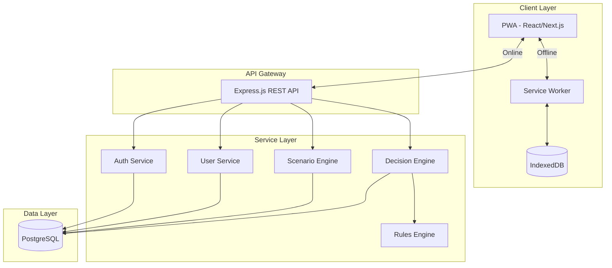
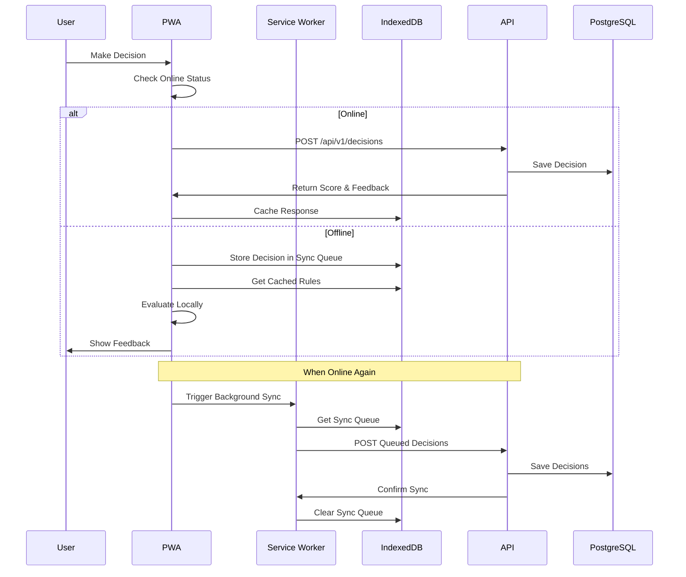

# Design Document: Financial Literacy Platform for Bharat

## Overview

This design document specifies the technical architecture and implementation approach for an offline-first gamified financial literacy platform targeting Indian students. The platform enables behavior-driven learning through simulation and decision-making, with a focus on rural-ready technology and cultural relevance.

### Design Philosophy

The platform follows these core principles:

1. **Offline-First Architecture**: All core functionality works without internet connectivity
2. **Progressive Enhancement**: Features gracefully degrade based on connectivity and device capabilities
3. **Modular Services**: Backend services are independently deployable and scalable
4. **Behavior-Driven Learning**: Emphasis on simulation and meaningful consequences over quizzes
5. **Cultural Relevance**: Indian context embedded throughout (currency, festivals, payment systems)
6. **Accessibility**: Inclusive design for users with varying abilities and literacy levels

### Technology Stack

**Frontend:**
- React.js 18+ with functional components and hooks
- Next.js 14+ for SSR and PWA capabilities
- Workbox for Service Worker management
- Dexie.js for IndexedDB abstraction
- i18next for internationalization
- Chart.js for progress visualization
- Tailwind CSS for responsive styling

**Backend:**
- Node.js 18+ with Express.js
- JWT for stateless authentication
- bcrypt for password hashing
- PostgreSQL 15+ for relational data
- Prisma ORM for database access
- Node-cron for scheduled tasks

**Infrastructure (Phase 1 - Local/Simple):**
- Docker for containerization
- Docker Compose for local development
- Simple deployment to single server

## Architecture

### High-Level Architecture



### Offline-First Data Flow



## Components and Interfaces

### 1. Frontend Components

#### 1.1 PWA Shell
- **Responsibility**: Application shell, routing, offline detection
- **Key Features**:
  - Service Worker registration and lifecycle management
  - Network status monitoring
  - App shell caching strategy
  - Route-based code splitting

#### 1.2 Authentication Module
- **Components**:
  - `LoginForm`: Email/password login
  - `RegisterForm`: User registration with user group selection
  - `AuthContext`: React context for auth state management
- **Local Storage**: JWT token in localStorage
- **IndexedDB**: User profile cache

#### 1.3 Scenario Player
- **Components**:
  - `ScenarioCard`: Displays scenario context and choices
  - `ChoiceButton`: Interactive decision buttons
  - `FeedbackModal`: Shows decision consequences
  - `ProgressIndicator`: Visual score changes
- **State Management**: React hooks for scenario state
- **Offline Support**: Scenarios pre-cached in IndexedDB

#### 1.4 Progress Dashboard
- **Components**:
  - `ScoreChart`: Line chart showing score trend
  - `ThemeProgress`: Progress by financial theme
  - `BadgeDisplay`: Earned badges and achievements
  - `Leaderboard`: Peer comparison
- **Visualization**: Chart.js for graphs
- **Data Source**: IndexedDB cache with API sync

#### 1.5 Demo Mode
- **Components**:
  - `DemoLanding`: Guest mode entry point
  - `DemoSession`: Temporary session management
- **Storage**: SessionStorage for temporary data
- **Conversion**: Prompt to register and save progress

### 2. Backend Services

#### 2.1 Authentication Service
```typescript
interface AuthService {
  register(data: RegisterDTO): Promise<AuthResponse>
  login(credentials: LoginDTO): Promise<AuthResponse>
  verifyToken(token: string): Promise<UserPayload>
  refreshToken(token: string): Promise<AuthResponse>
}

interface RegisterDTO {
  name: string
  email: string
  password: string
  userGroup: 'Student' | 'Young_Adult'
  language?: string
}

interface LoginDTO {
  email: string
  password: string
}

interface AuthResponse {
  token: string
  user: UserProfile
  expiresIn: number
}
```

#### 2.2 User Service
```typescript
interface UserService {
  getProfile(userId: string): Promise<UserProfile>
  updateProfile(userId: string, data: UpdateProfileDTO): Promise<UserProfile>
  getProgress(userId: string): Promise<UserProgress>
  updateProgress(userId: string, progress: ProgressUpdate): Promise<UserProgress>
}

interface UserProfile {
  userId: string
  name: string
  email: string
  userGroup: 'Student' | 'Young_Adult'
  financialScore: number
  language: string
  createdAt: Date
  updatedAt: Date
}

interface UserProgress {
  userId: string
  completedScenarios: string[]
  currentScore: number
  scoreTrend: ScorePoint[]
  badges: Badge[]
  themeProgress: ThemeProgress[]
}

interface ScorePoint {
  timestamp: Date
  score: number
}

interface Badge {
  badgeId: string
  name: string
  description: string
  earnedAt: Date
  icon: string
}

interface ThemeProgress {
  theme: string
  completed: number
  total: number
  averageScore: number
}
```

#### 2.3 Scenario Engine
```typescript
interface ScenarioEngine {
  getScenarios(userGroup: string, theme?: string): Promise<Scenario[]>
  getScenarioById(scenarioId: string): Promise<Scenario>
  getRecommendedScenarios(userId: string): Promise<Scenario[]>
}

interface Scenario {
  scenarioId: string
  title: string
  context: string
  difficulty: 'Easy' | 'Medium' | 'Hard'
  userGroup: 'Student' | 'Young_Adult'
  theme: string
  choices: Choice[]
  culturalContext?: string
  visualAssets?: VisualAsset[]
}

interface Choice {
  choiceId: string
  text: string
  icon?: string
  consequences: Consequence[]
}

interface Consequence {
  type: 'Score' | 'Feedback' | 'NextScenario'
  value: any
  description: string
}

interface VisualAsset {
  type: 'image' | 'icon' | 'illustration'
  url: string
  alt: string
}
```

#### 2.4 Decision Engine
```typescript
interface DecisionEngine {
  evaluateDecision(decision: DecisionDTO): Promise<DecisionResult>
  getDecisionHistory(userId: string, limit?: number): Promise<Decision[]>
  getPeerStatistics(scenarioId: string): Promise<PeerStats>
}

interface DecisionDTO {
  userId: string
  scenarioId: string
  choiceId: string
  clientEventId: string
  timestamp: Date
  timeSpent: number
}

interface DecisionResult {
  decisionId: string
  scoreChange: number
  newScore: number
  feedback: Feedback
  badgesEarned: Badge[]
  nextScenario?: string
}

interface Feedback {
  message: string
  type: 'Positive' | 'Negative' | 'Neutral'
  explanation: string
  tips: string[]
  visualCue: string
}

interface PeerStats {
  scenarioId: string
  totalAttempts: number
  choiceDistribution: ChoiceStats[]
  averageScore: number
}

interface ChoiceStats {
  choiceId: string
  percentage: number
  averageScoreChange: number
}
```

#### 2.5 Rules Engine
```typescript
interface RulesEngine {
  evaluateOffline(scenarioId: string, choiceId: string): Promise<OfflineResult>
  getCachedRules(userGroup: string): Promise<Rule[]>
}

interface Rule {
  ruleId: string
  scenarioId: string
  choiceId: string
  scoreChange: number
  feedback: string
  category: string
}

interface OfflineResult {
  scoreChange: number
  feedback: string
  isApproximate: boolean
}
```

### 3. API Endpoints

#### 3.1 Authentication Endpoints
```
POST   /api/v1/auth/register
POST   /api/v1/auth/login
POST   /api/v1/auth/refresh
GET    /api/v1/auth/verify
```

#### 3.2 User Endpoints
```
GET    /api/v1/users/profile
PUT    /api/v1/users/profile
GET    /api/v1/users/progress
POST   /api/v1/users/progress
```

#### 3.3 Scenario Endpoints
```
GET    /api/v1/scenarios?userGroup={group}&theme={theme}
GET    /api/v1/scenarios/:scenarioId
GET    /api/v1/scenarios/recommended
```

#### 3.4 Decision Endpoints
```
POST   /api/v1/decisions
GET    /api/v1/decisions/history
GET    /api/v1/decisions/peer-stats/:scenarioId
```

#### 3.5 Rules Endpoints
```
GET    /api/v1/rules/cached?userGroup={group}
```

## Data Models

### Database Schema (PostgreSQL)

```sql
-- Users Table
CREATE TABLE users (
  user_id UUID PRIMARY KEY DEFAULT gen_random_uuid(),
  name VARCHAR(255) NOT NULL,
  email VARCHAR(255) UNIQUE NOT NULL,
  password_hash VARCHAR(255) NOT NULL,
  user_group VARCHAR(50) NOT NULL CHECK (user_group IN ('Student', 'Young_Adult')),
  financial_score INTEGER DEFAULT 0,
  language VARCHAR(10) DEFAULT 'en',
  created_at TIMESTAMP DEFAULT CURRENT_TIMESTAMP,
  updated_at TIMESTAMP DEFAULT CURRENT_TIMESTAMP,
  deleted_at TIMESTAMP NULL
);

CREATE INDEX idx_users_email ON users(email);
CREATE INDEX idx_users_user_group ON users(user_group);

-- Scenarios Table
CREATE TABLE scenarios (
  scenario_id UUID PRIMARY KEY DEFAULT gen_random_uuid(),
  title VARCHAR(255) NOT NULL,
  context TEXT NOT NULL,
  difficulty VARCHAR(20) NOT NULL CHECK (difficulty IN ('Easy', 'Medium', 'Hard')),
  user_group VARCHAR(50) NOT NULL CHECK (user_group IN ('Student', 'Young_Adult')),
  theme VARCHAR(100) NOT NULL,
  cultural_context TEXT,
  choices JSONB NOT NULL,
  visual_assets JSONB,
  created_at TIMESTAMP DEFAULT CURRENT_TIMESTAMP,
  updated_at TIMESTAMP DEFAULT CURRENT_TIMESTAMP
);

CREATE INDEX idx_scenarios_user_group ON scenarios(user_group);
CREATE INDEX idx_scenarios_theme ON scenarios(theme);
CREATE INDEX idx_scenarios_difficulty ON scenarios(difficulty);

-- Decisions Table
CREATE TABLE decisions (
  decision_id UUID PRIMARY KEY DEFAULT gen_random_uuid(),
  user_id UUID NOT NULL REFERENCES users(user_id),
  scenario_id UUID NOT NULL REFERENCES scenarios(scenario_id),
  choice_id VARCHAR(100) NOT NULL,
  client_event_id VARCHAR(255) UNIQUE NOT NULL,
  score_change INTEGER NOT NULL,
  time_spent INTEGER,
  timestamp TIMESTAMP DEFAULT CURRENT_TIMESTAMP
);

CREATE INDEX idx_decisions_user_id ON decisions(user_id);
CREATE INDEX idx_decisions_scenario_id ON decisions(scenario_id);
CREATE INDEX idx_decisions_client_event_id ON decisions(client_event_id);
CREATE INDEX idx_decisions_timestamp ON decisions(timestamp);

-- Progress Table
CREATE TABLE progress (
  progress_id UUID PRIMARY KEY DEFAULT gen_random_uuid(),
  user_id UUID NOT NULL REFERENCES users(user_id),
  completed_scenarios JSONB DEFAULT '[]',
  score_history JSONB DEFAULT '[]',
  badges JSONB DEFAULT '[]',
  theme_progress JSONB DEFAULT '{}',
  updated_at TIMESTAMP DEFAULT CURRENT_TIMESTAMP
);

CREATE UNIQUE INDEX idx_progress_user_id ON progress(user_id);

-- Rules Table (for offline evaluation)
CREATE TABLE rules (
  rule_id UUID PRIMARY KEY DEFAULT gen_random_uuid(),
  scenario_id UUID NOT NULL REFERENCES scenarios(scenario_id),
  choice_id VARCHAR(100) NOT NULL,
  score_change INTEGER NOT NULL,
  feedback TEXT NOT NULL,
  category VARCHAR(100),
  created_at TIMESTAMP DEFAULT CURRENT_TIMESTAMP
);

CREATE INDEX idx_rules_scenario_id ON rules(scenario_id);

-- Badges Table
CREATE TABLE badges (
  badge_id UUID PRIMARY KEY DEFAULT gen_random_uuid(),
  name VARCHAR(255) NOT NULL,
  description TEXT NOT NULL,
  icon VARCHAR(255),
  criteria JSONB NOT NULL,
  created_at TIMESTAMP DEFAULT CURRENT_TIMESTAMP
);

-- User Badges (Many-to-Many)
CREATE TABLE user_badges (
  user_id UUID NOT NULL REFERENCES users(user_id),
  badge_id UUID NOT NULL REFERENCES badges(badge_id),
  earned_at TIMESTAMP DEFAULT CURRENT_TIMESTAMP,
  PRIMARY KEY (user_id, badge_id)
);

CREATE INDEX idx_user_badges_user_id ON user_badges(user_id);
```

### IndexedDB Schema

```typescript
// Database: FinancialLiteracyDB
// Version: 1

interface IndexedDBSchema {
  // Store: users
  users: {
    key: string // userId
    value: UserProfile
    indexes: {
      email: string
    }
  }
  
  // Store: scenarios
  scenarios: {
    key: string // scenarioId
    value: Scenario
    indexes: {
      userGroup: string
      theme: string
      difficulty: string
    }
  }
  
  // Store: decisions (sync queue)
  decisions: {
    key: string // clientEventId
    value: {
      decision: DecisionDTO
      result?: DecisionResult
      synced: boolean
      createdAt: Date
    }
    indexes: {
      synced: boolean
      userId: string
    }
  }
  
  // Store: progress
  progress: {
    key: string // userId
    value: UserProgress
  }
  
  // Store: rules (cached for offline)
  rules: {
    key: string // ruleId
    value: Rule
    indexes: {
      scenarioId: string
    }
  }
  
  // Store: assets (cached images/icons)
  assets: {
    key: string // url
    value: {
      blob: Blob
      contentType: string
      cachedAt: Date
    }
  }
}
```


## Correctness Properties

*A property is a characteristic or behavior that should hold true across all valid executions of a system—essentially, a formal statement about what the system should do. Properties serve as the bridge between human-readable specifications and machine-verifiable correctness guarantees.*

### Property 1: User Registration Creates Valid Accounts

*For any* valid registration data (name, email, password, user group), when a user registers, the system should create a new user account with a properly hashed password (bcrypt with salt rounds >= 10), and the password hash should not equal the plaintext password.

**Validates: Requirements 1.1, 11.1**

### Property 2: Valid Login Returns Valid JWT

*For any* registered user with valid credentials, when they log in, the system should return a JWT token that can be successfully verified and contains the correct user information (userId, email, userGroup).

**Validates: Requirements 1.2, 11.2**

### Property 3: Invalid Tokens Are Rejected

*For any* malformed, expired, or tampered JWT token, when it is submitted to a protected endpoint, the system should reject the request with 401 Unauthorized status.

**Validates: Requirements 1.3**

### Property 4: Duplicate Email Registration Prevention

*For any* email address that already exists in the system, when a new user attempts to register with that email, the system should reject the request with 409 Conflict status and not create a duplicate account.

**Validates: Requirements 1.4**

### Property 5: Offline Operation Queuing

*For any* user operation (decision, profile update) performed while offline, the PWA should store the operation in IndexedDB with a unique Client_Event_ID and add it to the Sync_Queue for later synchronization.

**Validates: Requirements 2.3, 2.4**

### Property 6: Background Sync Processes All Queued Operations

*For any* set of queued operations in IndexedDB, when network connectivity is restored and background sync triggers, all operations should be sent to the server and removed from the queue upon successful confirmation.

**Validates: Requirements 2.5**

### Property 7: Idempotent Operation Processing

*For any* operation with a Client_Event_ID, when the same operation is submitted multiple times (during sync retries), the system should process it exactly once and return consistent results for subsequent submissions.

**Validates: Requirements 2.6, 6.4**

### Property 8: User Group Scenario Filtering

*For any* user with a specific User_Group (Student or Young_Adult), when they request scenarios, the system should return only scenarios that match their User_Group and no scenarios from other groups.

**Validates: Requirements 3.1**

### Property 9: Scenario Data Completeness

*For any* scenario retrieved from the system, the response should include all required fields: title, context, difficulty level, userGroup, theme, and a non-empty array of choices.

**Validates: Requirements 3.2**

### Property 10: Decision Processing Completeness

*For any* valid decision submission, the Decision_Engine should evaluate the choice, calculate a score change, update the user's Financial_Score, return immediate feedback with explanation, and persist the decision to the database.

**Validates: Requirements 4.1, 4.2, 4.3, 4.4**

### Property 11: Offline-Online Score Reconciliation

*For any* decision made offline and later synced, when the server re-evaluates the decision, if there's a score difference between local and server evaluation, the system should reconcile by using the server score and updating the user's total score accordingly.

**Validates: Requirements 4.6**

### Property 12: Scenario Completion Tracking

*For any* scenario completion, the system should increment the user's completed scenarios count by exactly 1 and add the scenarioId to the user's completedScenarios list without duplicates.

**Validates: Requirements 5.1**

### Property 13: Score Trend Recording

*For any* Financial_Score change, the system should append a new ScorePoint (timestamp, score) to the user's score history, maintaining chronological order.

**Validates: Requirements 5.2**

### Property 14: Consistent API Response Structure

*For any* API endpoint response (success or error), the response should follow a consistent JSON structure with either a `data` field (for success) or an `error` field (for failures), and include appropriate HTTP status codes.

**Validates: Requirements 6.6**

### Property 15: Decision Consequences Application

*For any* decision made by a user, the system should apply realistic consequences including score changes, feedback messages, and potential effects on future scenario availability based on the decision quality.

**Validates: Requirements 14.1**

### Property 16: Decision Feedback Color Coding

*For any* decision result, the feedback should include an appropriate color code: green for positive score changes (>0), red for negative score changes (<0), and yellow for neutral (0), enabling visual distinction.

**Validates: Requirements 17.3**

### Property 17: Milestone Badge Awarding

*For any* user who reaches a defined milestone (first scenario completed, 10 scenarios completed, perfect score on a scenario), the system should award the corresponding badge exactly once and add it to the user's badge collection.

**Validates: Requirements 21.2**

### Property 18: Indian Currency Consistency

*For any* scenario that includes monetary amounts, all amounts should be formatted with the Indian Rupee symbol (₹) and follow Indian number formatting conventions (e.g., ₹1,00,000 for one lakh).

**Validates: Requirements 23.1**

### Property 19: Demo Progress Transfer

*For any* guest user who completes scenarios in demo mode and then registers, when they opt to transfer progress, all demo decisions, scores, and completed scenarios should be migrated to their new registered account.

**Validates: Requirements 24.7**

## Error Handling

### Error Categories

1. **Authentication Errors**
   - Invalid credentials → 401 Unauthorized
   - Expired token → 401 Unauthorized
   - Missing token → 401 Unauthorized
   - Duplicate email → 409 Conflict

2. **Validation Errors**
   - Missing required fields → 400 Bad Request
   - Invalid data format → 400 Bad Request
   - Invalid user group → 400 Bad Request

3. **Resource Errors**
   - Scenario not found → 404 Not Found
   - User not found → 404 Not Found
   - Decision not found → 404 Not Found

4. **Sync Errors**
   - Network timeout → Retry with exponential backoff
   - Server error → Queue for later retry
   - Conflict → Use server version and notify user

5. **Database Errors**
   - Connection failure → 503 Service Unavailable
   - Query timeout → 504 Gateway Timeout
   - Constraint violation → 409 Conflict

### Error Response Format

```typescript
interface ErrorResponse {
  error: {
    code: string
    message: string
    details?: any
    timestamp: Date
  }
}
```

### Offline Error Handling

When offline:
- Queue operations in IndexedDB
- Show user-friendly offline indicator
- Provide optimistic UI updates
- Retry sync when online

When sync fails:
- Exponential backoff (1s, 2s, 4s, 8s, 16s, max 60s)
- Maximum 5 retry attempts
- After max retries, notify user and keep in queue
- Manual sync trigger available

## Testing Strategy

### Dual Testing Approach

The platform requires both unit testing and property-based testing for comprehensive coverage:

**Unit Tests** focus on:
- Specific examples and edge cases
- Integration points between components
- Error conditions and boundary cases
- UI component rendering
- API endpoint responses

**Property Tests** focus on:
- Universal properties across all inputs
- Data integrity and consistency
- Idempotency and sync behavior
- Security properties (hashing, token validation)
- Business logic correctness

Together, unit tests catch concrete bugs while property tests verify general correctness across the input space.

### Property-Based Testing Configuration

**Library Selection:**
- **Frontend**: fast-check (TypeScript/JavaScript property testing)
- **Backend**: fast-check for Node.js services

**Configuration:**
- Minimum 100 iterations per property test
- Each test tagged with: `Feature: financial-literacy-platform, Property {N}: {property_text}`
- Seed-based reproducibility for failed tests
- Shrinking enabled to find minimal failing cases

**Example Property Test Structure:**

```typescript
import fc from 'fast-check'

describe('Feature: financial-literacy-platform, Property 1: User Registration Creates Valid Accounts', () => {
  it('should create valid accounts with hashed passwords for any valid registration data', () => {
    fc.assert(
      fc.property(
        fc.record({
          name: fc.string({ minLength: 1, maxLength: 255 }),
          email: fc.emailAddress(),
          password: fc.string({ minLength: 8, maxLength: 100 }),
          userGroup: fc.constantFrom('Student', 'Young_Adult')
        }),
        async (registrationData) => {
          const result = await authService.register(registrationData)
          
          expect(result.user).toBeDefined()
          expect(result.user.email).toBe(registrationData.email)
          expect(result.user.password_hash).not.toBe(registrationData.password)
          expect(result.user.password_hash).toMatch(/^\$2[aby]\$/)
        }
      ),
      { numRuns: 100 }
    )
  })
})
```

### Unit Testing Strategy

**Frontend Unit Tests:**
- Component rendering tests (React Testing Library)
- User interaction tests (fireEvent, userEvent)
- Hook behavior tests
- Service Worker lifecycle tests
- IndexedDB operations tests

**Backend Unit Tests:**
- API endpoint tests (supertest)
- Service layer tests (mocked database)
- Authentication middleware tests
- Validation tests
- Error handling tests

**Integration Tests:**
- End-to-end API flows
- Database transaction tests
- Offline-online sync scenarios
- Multi-user scenarios

### Test Coverage Goals

- Unit test coverage: >= 80%
- Property test coverage: All 19 correctness properties
- Integration test coverage: All critical user flows
- E2E test coverage: Core user journeys (register, play scenario, view progress)

### Testing Tools

- **Unit Testing**: Jest, React Testing Library
- **Property Testing**: fast-check
- **API Testing**: supertest
- **E2E Testing**: Playwright (Phase 2)
- **Coverage**: Istanbul/nyc
- **Mocking**: jest.mock, MSW (Mock Service Worker)

## Implementation Notes

### Phase 1 Priorities

For the hackathon prototype, prioritize:

1. **Core Offline Functionality**
   - Service Worker setup with Workbox
   - IndexedDB schema and operations
   - Background sync implementation

2. **Essential User Flows**
   - Registration and login
   - Scenario browsing and selection
   - Decision making and feedback
   - Progress viewing

3. **Visual Polish**
   - Responsive design
   - Visual feedback (colors, icons)
   - Progress visualization
   - Badge display

4. **Demo Mode**
   - Guest session creation
   - Sample scenarios
   - Registration conversion

5. **Indian Context**
   - ₹ currency formatting
   - Hindi translations (basic)
   - Cultural scenario content

### Deferred to Phase 2

- Full ML pipeline
- Advanced analytics
- CI/CD automation
- Performance optimization
- Extended language support
- Parental dashboard
- Text-to-speech

### Development Workflow

1. **Database Setup**: Create PostgreSQL schema, seed with sample scenarios
2. **Backend Services**: Implement core services (Auth, User, Scenario, Decision)
3. **API Layer**: Build REST endpoints with validation
4. **Frontend Shell**: Set up Next.js, PWA configuration, routing
5. **Offline Layer**: Implement Service Worker, IndexedDB, sync logic
6. **UI Components**: Build React components for scenarios, progress, badges
7. **Integration**: Connect frontend to backend, test offline-online transitions
8. **Polish**: Add visual assets, translations, demo mode
9. **Testing**: Write property tests and unit tests
10. **Documentation**: API docs, deployment guide

### Key Technical Decisions

**Why PostgreSQL over MongoDB for primary storage?**
- Relational data (users, scenarios, decisions) benefits from ACID guarantees
- Foreign key constraints ensure data integrity
- Better support for complex queries (joins, aggregations)
- Prisma ORM provides excellent TypeScript support

**Why IndexedDB over LocalStorage?**
- Larger storage capacity (no 5-10MB limit)
- Structured data with indexes for efficient queries
- Asynchronous API (non-blocking)
- Support for complex data types (Blobs for images)

**Why JWT over session-based auth?**
- Stateless authentication (no server-side session storage)
- Works well with offline-first (token stored locally)
- Scalable (no session synchronization needed)
- Standard format with good library support

**Why Workbox over manual Service Worker?**
- Battle-tested caching strategies
- Automatic cache versioning
- Background sync abstraction
- Precaching and runtime caching patterns
- Better developer experience

### Security Considerations

1. **Password Security**
   - bcrypt with 10+ salt rounds
   - Minimum password length: 8 characters
   - No password in logs or error messages

2. **JWT Security**
   - Short expiration (24 hours)
   - Secure secret key (environment variable)
   - HTTPS only in production
   - Token in Authorization header (not URL)

3. **Input Validation**
   - Sanitize all user inputs
   - Validate email format
   - Validate user group enum
   - Prevent SQL injection (use parameterized queries)
   - Prevent XSS (escape output)

4. **API Security**
   - CORS configuration
   - Rate limiting (Phase 2)
   - Request size limits
   - Authentication on protected routes

5. **Offline Security**
   - IndexedDB not encrypted (browser security)
   - Sensitive data (password) never stored locally
   - JWT token in localStorage (acceptable for prototype)
   - Clear token on logout
